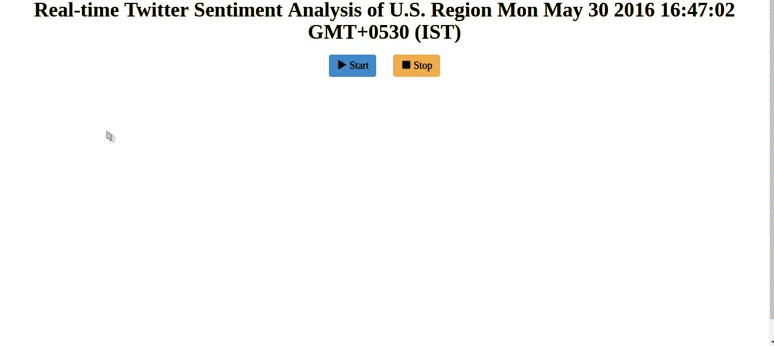

# Storm Tweets SentimentAnalysis of U.S. Region D3+Highcharts
----------

## Features
* Application retrieves tweets using Twitter Streaming API (using [Twitter4J](http://twitter4j.org)). 
* It analyses sentiments of all the tweets originating from US.
* There are three different objects within a tweet that we can use to determine it’s origin. This application tries to find the location using all the three options and prioritizes location received in the following order [high to low]:
	* The coordinates object.
	* The place object.
	* The user object.
* For reverse geocoding, this application uses Bing Maps API. 
* This application uses [AFINN](http://www2.imm.dtu.dk/pubdb/views/publication_details.php?id=6010) which contains a list of pre-computed sentiment scores.
	* These words are used to determine sentiment of the each tweet which is retrieved using Streaming API.
* By understanding sentiment values, we can get the most happiest state of US and most unhappiest state as well.
* For visualization, I am using D3 to display the sentiment value of each state in real-time by conveying it in a color, appropriate to the sentiment value. Color of the State moves from red to green, as its corresponding sentiment value improves. 
* There is another visualization context using Highcharts, which is a column chart of each State and its corresponding sentiment value. This chart also updates in real-time based on the sentiment value of each of the state.

## Demo
### D3 Choropleth Visualization
#### GIF of D3 Choropleth Visualization

### Highcharts Visualization
#### GIF of Highcharts Visualization

